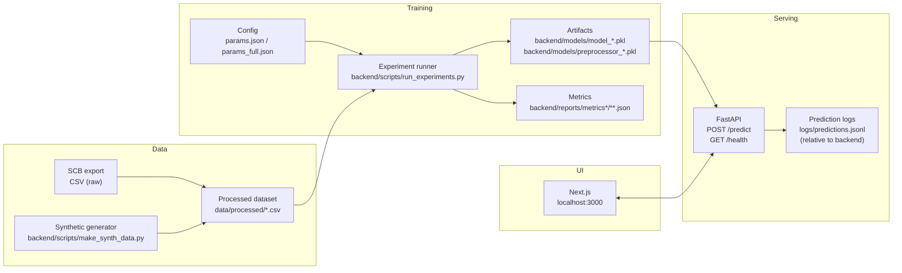

# Stockholm Price Intelligence

End-to-end ML + web app that predicts Stockholm apartment (bostadsrätt) value from structured features.

- **Outputs**: predicted SEK/kvm and derived total price
- **UI**: Next.js (TypeScript + Tailwind)
- **API**: FastAPI (`POST /predict`, `GET /health`)
- **Training**: scikit-learn experiments → exported artifacts (model + preprocessor)

## Architecture


## Quickstart (local)

### Prereqs
- Python 3.11+
- Node.js (CI uses 22)

### 1) Backend: install
From repo root (PowerShell):

```powershell
python -m venv backend/.venv
backend/.venv/Scripts/python -m pip install -U pip
backend/.venv/Scripts/python -m pip install -e backend[dev]
```

### 2) Train (optional)

#### Full-feature synthetic model (recommended for demo)
This trains a model where **all UI inputs influence the prediction**.

```powershell
backend/.venv/Scripts/python backend/scripts/make_synth_data.py --out data/processed/train_full.csv --n 20000
backend/.venv/Scripts/python backend/scripts/run_experiments.py --params params_full.json --model rf --version full_v1
```

Artifacts created:
- `backend/models/model_full_v1.pkl`
- `backend/models/preprocessor_full_v1.pkl`

#### SCB data (optional)
- Place your export at `data/raw/scb.csv` (or change `params.json`)
- Map columns via `params.json:data.column_map` (SCB exports vary)

```powershell
backend/.venv/Scripts/python backend/scripts/prepare_data.py --params params.json
backend/.venv/Scripts/python backend/scripts/run_experiments.py --params params.json --model baseline --version scb_v1
```

### 3) Run API

#### One-command start (SCB model, port 8000)
```powershell
powershell -ExecutionPolicy Bypass -File backend/scripts/run_api_scb.ps1
```

#### One-command start (full-feature model, port 8001)
```powershell
powershell -ExecutionPolicy Bypass -File backend/scripts/run_api_full.ps1
```

Health check:
- `http://localhost:8000/health` (SCB)
- `http://localhost:8001/health` (full-feature)

Prediction logs (default): `backend/logs/predictions.jsonl`

### 4) Frontend
From repo root:

```powershell
cd frontend
npm ci
npm run dev
```

By default the UI calls `http://localhost:8000`. To point it at the full-feature API, create `frontend/.env.local`:

```ini
NEXT_PUBLIC_API_BASE_URL=http://localhost:8001
```

Open: `http://localhost:3000`

## API

### `POST /predict`
Request:

```json
{
	"area": 65,
	"rooms": 2,
	"district": "Södermalm",
	"year_built": 1998,
	"monthly_fee": 3200,
	"transaction_year": 2022
}
```

Response:

```json
{
	"predicted_price_per_sqm": 72000,
	"predicted_total_price": 4680000,
	"model_version": "full_v1",
	"inference_ms": 12.3
}
```

## Metrics
- Per-run metrics: `backend/reports/metrics*/run_*.json`
- Latest metrics: `backend/reports/metrics*/latest.json`

## CI
GitHub Actions workflow: `.github/workflows/ci.yml`
- Backend: ruff + pytest
- Frontend: lint + build
- Docker: builds `backend/Dockerfile`

## Troubleshooting
- **UI loads but no result**: change inputs and click **Predict** again.
- **Prediction not changing**: the SCB model may not use every UI feature; use the full-feature model for a demo where all inputs affect the output.
- **API not reachable**: ensure Uvicorn is listening on `8000` (SCB) or `8001` (full-feature).

## Optional

### DVC (data/model versioning)
`dvc.yaml` is included as a starting point for `prepare` and `train` stages.

```bash
dvc init
dvc repro
```

### Docker (backend)
```bash
docker build -t spi-backend -f backend/Dockerfile backend
docker run -p 8000:8000 spi-backend
```

## Deploy (public link)

This project is easiest to deploy as:
- **Backend API**: Render (Docker web service)
- **Frontend**: Vercel (Next.js)

### 1) Deploy backend (Render)
1. Push the repo to GitHub.
2. In Render: **New** → **Web Service** → connect the repo.
3. Select **Docker** and set **Root Directory** to `backend`.
4. Add environment variables (example: SCB model):
	- `MODEL_PATH=models/model_scb_v2.pkl`
	- `PREPROCESSOR_PATH=models/preprocessor_scb_v2.pkl`
	- `MODEL_VERSION=scb_v2`
	- `TARGET_MODE=total_price`
	- `METRICS_PATH=reports/metrics/latest.json`
	- Optional (recommended after frontend is deployed):
	  - `CORS_ALLOW_ORIGIN=https://<your-vercel-domain>`

Render provides `PORT` automatically; the container will listen on it.

Verify backend after deploy:
- Open `https://<your-render-service>/health` → should return `{ "ok": true }`
- Open `https://<your-render-service>/model-info`

### 2) Deploy frontend (Vercel)
1. In Vercel: **Add New** → **Project** → import the repo.
2. Set **Root Directory** to `frontend`.
3. Add environment variable:
	- `NEXT_PUBLIC_API_BASE_URL=https://<your-render-service>`
4. Deploy.

Verify frontend:
- Open `https://<your-vercel-domain>`
- Run a prediction (tab **Predict/Prediktera**) and confirm results.

### Common gotchas
- If the UI shows network errors, confirm `NEXT_PUBLIC_API_BASE_URL` is set in Vercel and that the backend `/health` is reachable.
- If you set `CORS_ALLOW_ORIGIN`, ensure it matches your deployed frontend origin exactly (including `https://`).
